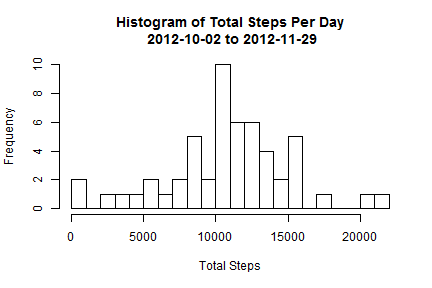
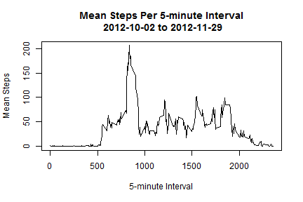
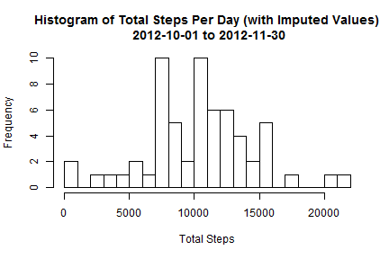
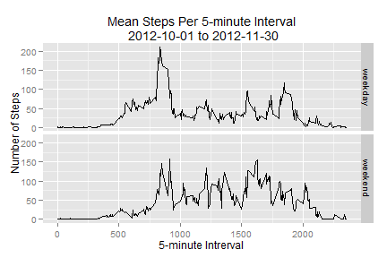

## Reproducible Research: Peer Assessment 1

### Summary

This analysis makes use of data collected from a personal activity monitoring device worn by an anonymous individual during the months of October and November 2012.  The raw data set represents the number of steps taken by the individual in 5 minute intervals each day of the collection period.

#### Data Source and Description

The archive [activity.zip][1] contains a single file named *activity.csv*.  The variables defined in this data set are:

- steps: Number of steps taken in a 5-minute interval (missing values are coded as NA).
- date: The date on which the measurement was taken in YYYY-MM-DD format.
- interval: Identifier for the 5-minute interval in which measurement was taken.

The data set is stored in a comma-separated-value (CSV) file and there are a total of 17,568 observations.  The first line in the file contains the colunmn labels.

#### Analysis Environment

This analysis was carried out using [RStudio 0.98.977][2] and [R version 3.1.1 (2014-07-10)][3].  The following libraries were used:


```r
require(stats)
require(utils)
require(ggplot2)
```

```
## Loading required package: ggplot2
```

### Loading and Preprocessing the Data

First we pull in the raw data set and see how the columns are interpreted.

```r
unzip("activity.zip")
activities <- read.csv("activity.csv", header = T)
str(activities)
```

```
## 'data.frame':	17568 obs. of  3 variables:
##  $ steps   : int  NA NA NA NA NA NA NA NA NA NA ...
##  $ date    : Factor w/ 61 levels "2012-10-01","2012-10-02",..: 1 1 1 1 1 1 1 1 1 1 ...
##  $ interval: int  0 5 10 15 20 25 30 35 40 45 ...
```

Then we generate some simple statistics to see what the raw data looks like before any procesing or clean-up is applied. First up let's see where NAs are present and in what quantity.


```r
colSums(is.na(activities))
```

```
##    steps     date interval 
##     2304        0        0
```

```r
colMeans(is.na(activities)) * 100
```

```
##    steps     date interval 
##    13.11     0.00     0.00
```

We see that the *steps* variable is approximately 13% NAs while the other variables are completely free of NAs.

### Q: What is mean total number of steps taken per day?

First off let's generate a histogram of total steps taken per day.  NAs are ignored and we group the remaining data by date.  Fortunately, the *date* variable is a factor.


```r
sumOfSteps <- aggregate(steps ~ date, data = activities, FUN = "sum")

title <- paste("Histogram of Total Steps Per Day\n",
               sumOfSteps[1,"date"],
               "to",
               sumOfSteps[nrow(sumOfSteps),"date"])

hist(x = sumOfSteps$steps, breaks = 24, main = title, xlab = "Total Steps")
```



The mean and median appear to be approximately 10,000.  Let's calculate the actual values.


```r
mean(sumOfSteps$steps)
```

```
## [1] 10766
```

```r
median(sumOfSteps$steps)
```

```
## [1] 10765
```

### Q: What is the average daily activity pattern?

Now we generate a time series plot of the average steps taken per 5-minute interval over the course of a day.  As before NAs are ignored but now we group the data by interval and take the mean.


```r
meanOfSteps <- aggregate(steps ~ interval, data = activities, FUN = "mean")
maxStepsInterval <- meanOfSteps[which.max(meanOfSteps$steps), "interval"]

title <- paste("Mean Steps Per 5-minute Interval\n",
               sumOfSteps[1,"date"],
               "to",
               sumOfSteps[nrow(sumOfSteps),"date"])

plot(meanOfSteps, type = "l", main = title, xlab = "5-minute Interval", ylab = "Mean Steps")
```



The interval in which the maximum average number of steps was recorded is 835 which is given by the *maxStepsInterval* variable calculated above.

### Imputing Missing Values

We found the total number of NAs in the data set earlier.  Let's do it again in a slightly different way.  The *complete.cases* function is a simple way to determine how many observations are complete (that is, contain no NAs in any column).


```r
nrow(activities) - sum(complete.cases(activities))
```

```
## [1] 2304
```

This agrees with the previous value of 2304.  Now we need to impute values for all of the NAs in the original data set.  Earlier we found that only the *steps* variable contains NAs which is good because we only need the step means from the *meanOfSteps* variable.

Find the indicies where the *steps* variable is NA.  Then map the *interval* found at these indicies into a second set of indicies for *meanOfSteps*.  The *steps* variable at this second set of indicies provides the imputed values.


```r
naIndicies <- which(is.na(activities$steps))
imputedSteps <- meanOfSteps[(activities[naIndicies,"interval"] %/% 5) + 1, "steps"]

imputedActivities <- data.frame(activities)
imputedActivities[naIndicies, "steps"] <- imputedSteps

str(imputedActivities)
```

```
## 'data.frame':	17568 obs. of  3 variables:
##  $ steps   : num  1.717 0.3396 0.1321 0.1509 0.0755 ...
##  $ date    : Factor w/ 61 levels "2012-10-01","2012-10-02",..: 1 1 1 1 1 1 1 1 1 1 ...
##  $ interval: int  0 5 10 15 20 25 30 35 40 45 ...
```

Now generate an updated histogram of the total steps taken per day.  This time the data includes imputed values so we would expect the mean and median to change.


```r
sumOfStepsImputed <- aggregate(steps ~ date, data = imputedActivities, FUN = "sum")

title <- paste("Histogram of Total Steps Per Day (with Imputed Values)\n",
               sumOfStepsImputed[1,"date"],
               "to",
               sumOfStepsImputed[nrow(sumOfStepsImputed),"date"])

hist(x = sumOfStepsImputed$steps, breaks = 24, main = title, xlab = "Total Steps")
```



The mean and median are a little less clear in this new histogram.  Let's calculate them for the original and new data sets and see how they compare.


```r
matrix(data = c(mean(sumOfSteps$steps), median(sumOfSteps$steps),
                mean(sumOfStepsImputed$steps), median(sumOfStepsImputed$steps)),
       dimnames = list(c("Mean", "Median"), c("Original", "Imputed")),
       nrow = 2, ncol = 2)
```

```
##        Original Imputed
## Mean      10766   10282
## Median    10765   10395
```

The mean and median for the imputed data set are lower than the original.  Including imputed values has shifted the mean and median to the left.

### Are there differences in activity patterns between weekdays and weekends?

To answer this question let's first add a 2-level factor to the *imputedActivities* data set.  The factor will indicate whether an observeration was made on a *weekday* or a *weekend*.


```r
toLevel <- function(x) {
    if (x %in% c("Saturday", "Sunday")) "weekend" else "weekday"
}

imputedActivities$day <- sapply(weekdays(as.Date(imputedActivities$date)), toLevel)
imputedActivities$day <- as.factor(imputedActivities$day)

str(imputedActivities)
```

```
## 'data.frame':	17568 obs. of  4 variables:
##  $ steps   : num  1.717 0.3396 0.1321 0.1509 0.0755 ...
##  $ date    : Factor w/ 61 levels "2012-10-01","2012-10-02",..: 1 1 1 1 1 1 1 1 1 1 ...
##  $ interval: int  0 5 10 15 20 25 30 35 40 45 ...
##  $ day     : Factor w/ 2 levels "weekday","weekend": 1 1 1 1 1 1 1 1 1 1 ...
```

Now a panel plot is generated of the 5-minute interval (x-axis) and the average number of steps taken (y-axis).  The plot is conditioned on the *day* variable to show the difference in activity patterns between weekdays and weekends.


```r
meanOfStepsImputed <- aggregate(steps ~ interval + day, data = imputedActivities, FUN = "mean")

title <- paste("Mean Steps Per 5-minute Interval\n",
               imputedActivities[1,"date"],
               "to",
               imputedActivities[nrow(imputedActivities),"date"])

qplot(interval, steps, data = meanOfStepsImputed,
      facets = day ~ .,
      geom = c("line"),
      main = title,
      ylab = "Number of Steps",
      xlab = "5-minute Intrerval")
```



No background on the individual was given, but the graphs clearly show there is a difference in the activity patterns.  The *weekday* pattern has high peak in the mid morning followed by a relatively quiet period followed by a more active late afternoon.  The *weekend* pattern shows relatively consistent activity from mid morning to early evening.

Based upon this analysis one could reasonably assume the individual has an active morning routine (walking a dog, getting children ready for school, etc.) and a job that doesn't require much walking.  On the weekends the individual is generally more active for longer periods.

---
Link references used in body of document.
---
[1]: https://d396qusza40orc.cloudfront.net/repdata%2Fdata%2Factivity.zip
[2]: http://www.rstudio.com/
[3]: http://www.r-project.org/
